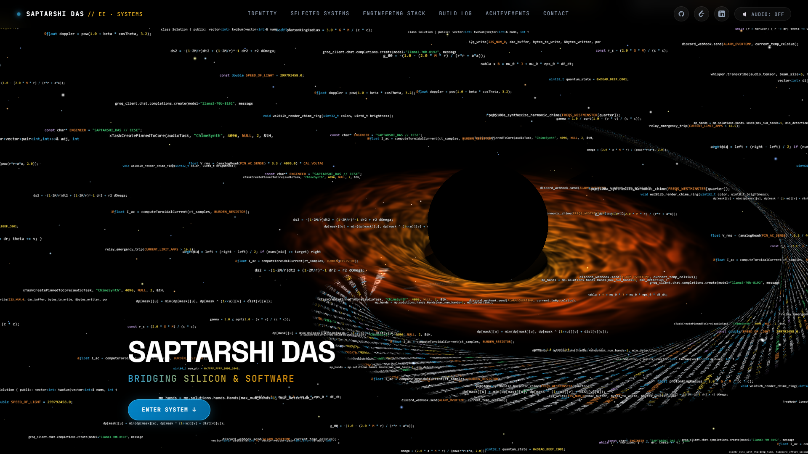
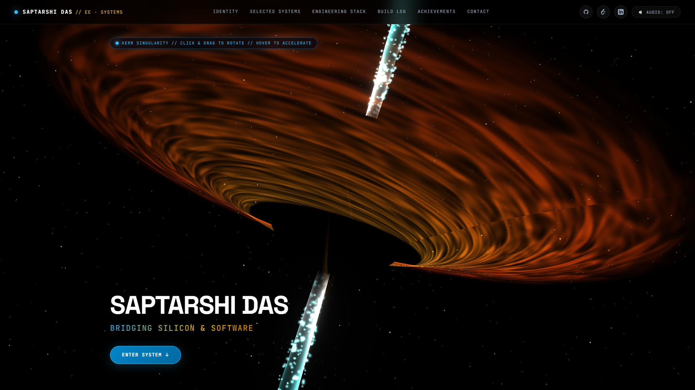
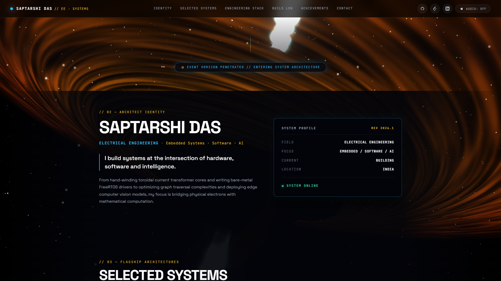
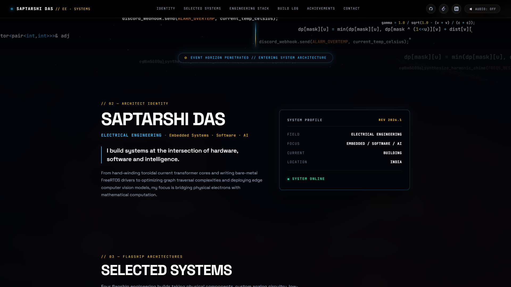
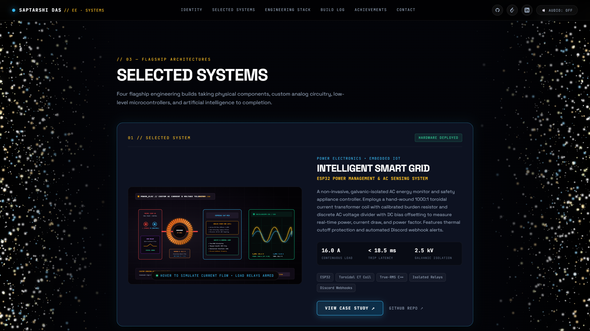
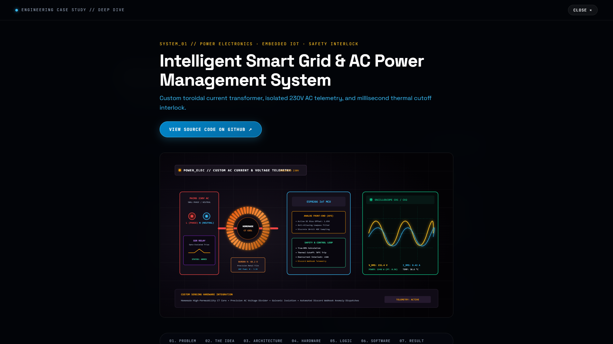
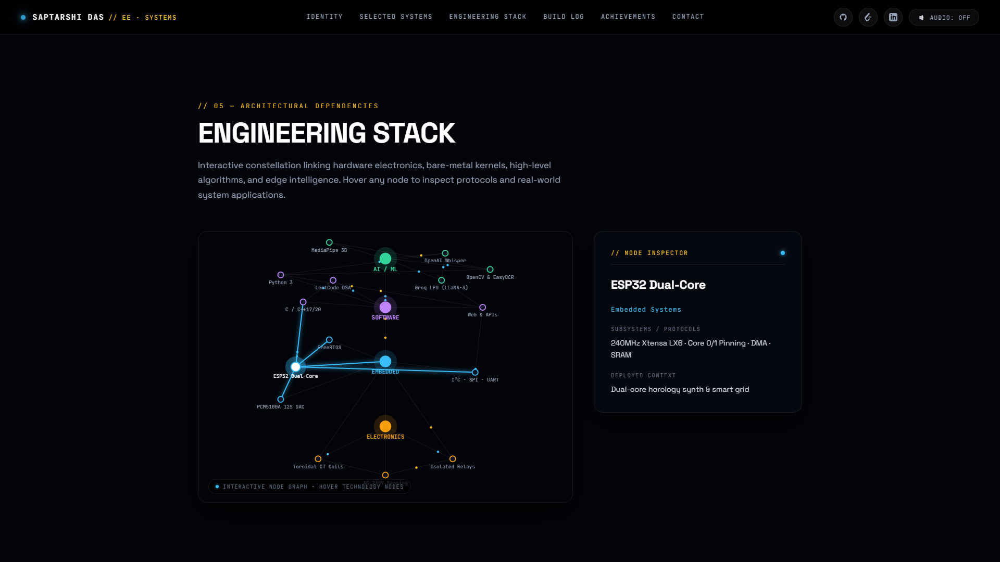
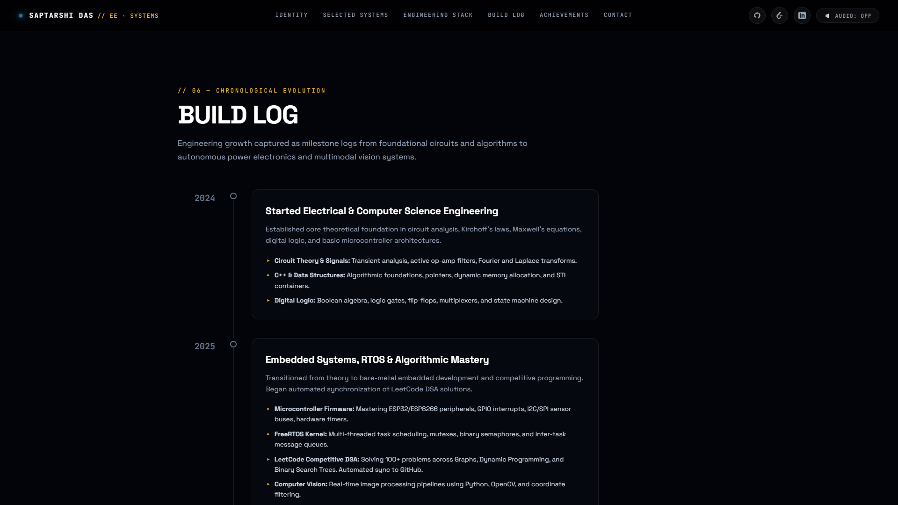
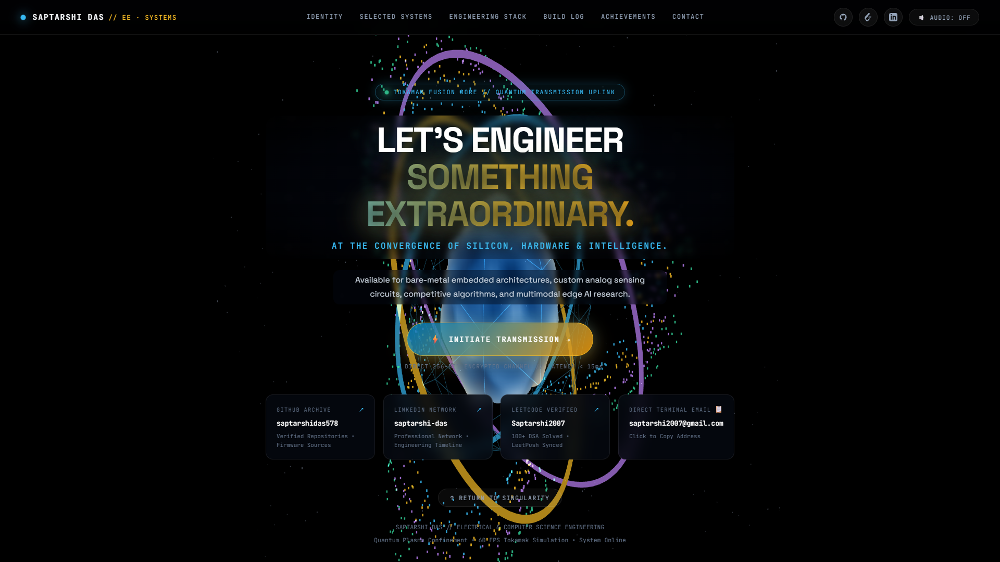
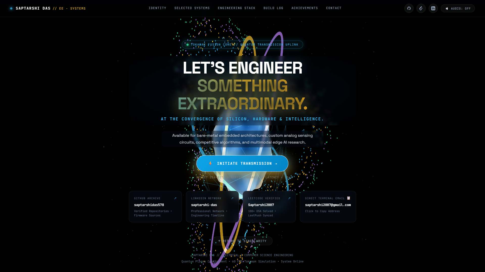

# Saptarshi Das // Portfolio & Cyber-Physical Systems Showcase

<div align="center">


**Bridging Silicon, Bare-Metal Firmware, Algorithms & Multimodal Intelligence.**

[Live Production Deployment (Netlify)](https://saptarshidas-portfolio.netlify.app/) • [Architecture](#architecture--narrative-flow) • [Featured Systems](#flagship-engineering-systems) • [Local Setup](#local-development)

</div>

---

## Overview

This repository houses the personal portfolio and cyber-physical engineering showcase of **Saptarshi Das** (Electrical & Computer Science Engineering). 

Rather than adopting a static resume format, this project represents an **end-to-end interactive 3D WebGL narrative** built from first principles with **Vanilla CSS, JavaScript, and Three.js**. The experience models the physics of a **spinning Kerr Black Hole** consuming procedural firmware and algorithmic source code, invites the user to dive past the **Event Horizon**, and emerges into an information-dense cyber-physical systems command center before concluding with a real-time **Tokamak Magnetic Confinement Fusion Reactor Core**.

---

## Visual Showcase

### 01 — Centered Kerr Black Hole with Dual Relativistic Plasma Jets
The visual source of truth: An astrophysically accurate supermassive **Kerr Singularity** positioned dead-center, flanked by **twin relativistic gas/plasma jets** erupting along its magnetic poles (north and south) at near light-speed. 
- **Sky of 7,000+ Stars:** Multi-spectral celestial field (O/B ionized blue, A diamond white, G solar, K amber, M red) with realistic scintillation.
- **Hover Acceleration:** Hovering over the singularity accelerates disk spin and particle ejection by **2.5×**.
- **Click-and-Drag 3D Rotation:** Full interactive control over orbital pitch and yaw with smooth inertial damping.
- **Normal Scrolling:** Smooth mouse-wheel scrolling is preserved without interruption.

| Centered Singularity & Dual Relativistic Jets | Interactive 3D Click-and-Drag Rotation |
| :---: | :---: |
|  |  |

---

### 02 — Scroll-Driven Starfield Scattering & Side-Margin Framing
As the user scrolls down from the hero:
1. **Dynamic Outward Scatter:** Relativistic shockwaves cause the stars to explode outward radially during mid-scroll.
2. **Side-Margin Migration:** 7,000 stars seamlessly migrate into two luminous columns flanking the left and right edges of the screen ($|X_{ndc}| \in [0.62, 0.98]$), completely clearing the central reading corridor.
3. **Persistent Viewport Anchoring:** Stars remain anchored along the left and right margins throughout all subsequent sections (Identity, Selected Systems, Engineering Stack, Build Log, Achievements, Contact Reactor), gently scintillating as the user scrolls.

| Mid-Scroll Outward Star Scatter | Persistent Side-Margin Framing (Identity Section) |
| :---: | :---: |
|  |  |

---

### 03 — Flagship Engineering Systems
Massive, viewport-commanding systems with interactive hardware blueprints, domain classifications, verified hardware metrics, and component-level technology pills.



---

### 04 — Full-Screen 7-Stage Engineering Case Study Overlay
Clicking **VIEW CASE STUDY ↗** opens an in-depth technical dossier following an uncompromising 7-stage engineering methodology: *Problem → Concept → System Architecture (ASCII) → Hardware Specs → Control Logic & Interlocks → Firmware/Telemetry → Quantitative Benchmarks*.



---

### 05 — Interactive Engineering Stack (Neural / Circuit Constellation)
A 60 FPS HTML5 canvas constellation mapping the engineering graph across **Electronics**, **Embedded Systems**, **Software Engineering**, and **AI/ML**. Circuit traces pulse with moving electron particles, and hovering any node reveals a live telemetry card detailing protocols, specs, and projects.



---

### 06 — Chronological Build Log & Credential Verifications
A vertical developer milestone timeline tracking foundational circuit theory (2024), real-time embedded systems & competitive DSA (2025), active hardware builds (2026), and future FPGA acceleration (2027+), alongside verified credential modals.



---

### 07 & 08 — Tokamak Fusion Reactor & Quantum Uplink (Finale)
A creative, eye-catching finale tailored for an Electrical & Computer Science engineer: a **3D Tokamak Magnetic Confinement Plasma Fusion Reactor Core** with 3-axis counter-rotating gyroscopic coils, superheated noise plasma, and 1,400 toroidal helical flux particles. Hovering over the encrypted transmission button excites the core into **Hyper-Drive mode (2.8× spin rate)**.

| Standard Confinement State | Hyper-Drive Excitation (On Hover) |
| :---: | :---: |
|  |  |

---

## Flagship Engineering Systems

### 1. Intelligent Smart Grid & AC Power Monitoring System
- **Domain:** Power Electronics • Embedded Safety • True-RMS C++
- **Hardware:** Hand-wound 1000:1 toroidal current transformer (CT) coil, active DC-bias shift front-end, isolated solid-state relay interlocks.
- **Firmware:** High-frequency ADC sampling pipeline on ESP32 Core 0, real-time Simpson's rule numerical integration for True-RMS current, instant overcurrent trip interlock.
- **Key Metrics:** 16.0 A continuous load, < 18.5 ms fault interruption, 2.5 kV galvanic isolation.
- **Repository:** [Smart_ac_control_system](https://github.com/saptarshidas578/Smart_ac_control_system)

### 2. ESP32 Dual-Core Smart Grandfather Clock
- **Domain:** Electro-Acoustic Horology • FreeRTOS • I2S Digital Audio
- **Hardware:** ESP32 (Xtensa dual-core LX6 @ 240 MHz), Texas Instruments PCM5100A 32-bit I2S stereo DAC, DS1307 battery-backed RTC, WS2812B NeoPixel aura ring.
- **Firmware:** FreeRTOS dual-task architecture pinning audio DMA synthesis to Core 0 (0.0 µs jitter) while Core 1 manages NTP time synchronization, ambient light sensing, and chimes.
- **Key Metrics:** 32-bit audio resolution, 0.0 ms audio underrun jitter, dual-core task pinning.
- **Repository:** [ESP32-Smart-Grandfather-Clock](https://github.com/saptarshidas578/ESP32-Smart-Grandfather-Clock)

### 3. Multimodal AI Interview Intelligence Assistant
- **Domain:** Edge Machine Learning • Computer Vision • Low-Latency NLP
- **Pipeline:** OpenAI Whisper acoustic feature extraction, Google MediaPipe 468-point 3D facial landmark mesh for micro-expression tracking, Groq LPU LLaMA-3 70B inference engine.
- **Key Metrics:** < 120 ms transcription latency, 280+ tokens/sec LLM evaluation, 468 tracked 3D landmarks.

### 4. Air Whiteboard Pro — 60 FPS Spatial Gesture Computing
- **Domain:** Spatial Computing • Computer Vision • Real-Time DSP
- **Pipeline:** Real-time 21-node hand skeleton tracking via webcam, Kalman filter trajectory prediction with Euclidean velocity gating, EasyOCR stroke-to-LaTeX converter.
- **Key Metrics:** 60 FPS locked tracking, zero-contact input, real-time math formula export.

---

## Technical Architecture & Mathematical Foundations

### 1. Relativistic Kerr Metric Ray Marching & Code Streams
The central black hole simulates the gravitational lensing and frame-dragging of a rotating Kerr black hole:

$$\Omega = \frac{2aMr}{\rho^4}$$

Code snippets and telemetry strings are instantiated as procedural particle billboards orbiting in an inclined accretion geometry ($i \approx 62^\circ$). Tangential orbital velocity follows relativistic Keplerian mechanics:

$$v_\phi = \sqrt{\frac{GM}{r}} \cdot \frac{1}{\sqrt{1 - \frac{3GM}{rc^2}}}$$

Relativistic beaming modulates color and intensity based on the angle between the emitter's orbital vector and the camera look vector:

$$I_{\text{observed}} = I_0 \cdot \left[\gamma (1 - \beta \cos\theta)\right]^{-3}$$

### 2. Tokamak Magnetic Confinement Equations
The Section 08 reactor simulates 1,400 magnetic flux particles tracing magnetic field lines along a nested torus:

$$\begin{aligned}
x &= (R + r \cos(v)) \cos(u) \\
y &= (R + r \cos(v)) \sin(u) \\
z &= r \sin(v) + \delta \sin(k \cdot u)
\end{aligned}$$

where $R = 3.6$ is the major radius, $r = 1.35$ is the minor radius, and $q = \frac{du}{dv}$ represents the magnetic safety factor preventing plasma instability.

---

## Project Structure

```text
portfolio-website/
├── index.html                   # Semantic HTML5 single-page application & SEO metadata
├── netlify.toml                 # Production Netlify build & security headers
├── vite.config.js               # Fast Vite configuration
├── package.json                 # Dependency manifest and scripts
├── .gitignore                   # Strict version control ignore rules
├── public/
│   └── assets/                  # High-resolution SVG blueprints, portrait & contact video
│       ├── smart_ac_hardware.svg
│       ├── esp32_smart_clock.svg
│       ├── ai_interview_assistant.svg
│       ├── air_whiteboard_cv.svg
│       ├── saptarshi_profile.jpg
│       ├── first_touch_portrait.mp4
│       ├── first_touch_portrait_poster.jpg
│       └── pcb/                 # High-density EDA PCB artifacts
├── docs/
│   └── images/                  # High-definition visual documentation previews
└── src/
    ├── main.js                  # Application lifecycle, scroll rigs & audio synthesis
    ├── style.css                # Dark cosmic design system, typography & glassmorphism
    ├── shaders/                 # Relativistic Kerr black hole GLSL shaders
    └── systems/
        ├── BlackHoleSystem.js           # 3D Kerr black hole & accretion shader
        ├── CaseStudyController.js       # Dynamic 7-stage case study modal engine
        ├── CodeStreamSystem.js          # Procedural relativistic code streams
        ├── ConstellationSystem.js       # 60 FPS neural/circuit node constellation
        ├── CosmicAudioSynthesizer.js    # Web Audio API ambient spatial sound engine
        ├── NerdStatsOverlay.js          # Real-time Stats for Nerds telemetry HUD
        ├── PostProcessingPipeline.js    # Cinematic bloom & dispersion pipeline
        ├── ScrollCameraRig.js           # Smooth scroll camera controller
        └── StarfieldSystem.js           # Deep space cosmic starfield
```

---

## Local Development

### Prerequisites
- [Node.js](https://nodejs.org/) (v18.0.0 or higher recommended)
- [npm](https://www.npmjs.com/) or [pnpm](https://pnpm.io/)

### Installation

1. **Clone the repository:**
   ```bash
   git clone https://github.com/saptarshidas578/portfolio-website.git
   cd portfolio-website
   ```

2. **Install dependencies:**
   ```bash
   npm install
   ```

3. **Start local development server:**
   ```bash
   npm run dev
   ```
   Open your browser and navigate to `http://localhost:5173/`.

4. **Production Build:**
   ```bash
   npm run build
   ```
   The compiled bundle will be output to the `dist/` directory.

---

## Deployment

### Deploying to GitHub Pages

1. In `vite.config.js`, set the base path to your repository name:
   ```javascript
   export default {
     base: '/portfolio-website/',
   };
   ```
2. Build the project:
   ```bash
   npm run build
   ```
3. Deploy the `dist` folder via GitHub Actions or the `gh-pages` branch.

### Deploying to Vercel or Netlify
Simply connect your GitHub repository to Vercel or Netlify. The build command `npm run build` and output directory `dist` are automatically detected.

---

## Engineering Profile & Direct Links

- **GitHub:** [@saptarshidas578](https://github.com/saptarshidas578)
- **LinkedIn:** [Saptarshi Das](https://www.linkedin.com/in/saptarshi-das-3255673a1/)
- **LeetCode:** [@Saptarshi2007](https://leetcode.com/u/Saptarshi2007/)
- **Terminal Email:** [saptarshi2007@gmail.com](mailto:saptarshi2007@gmail.com)

---

## License

This project is licensed under the **MIT License** — see the [LICENSE](LICENSE) file for details.
